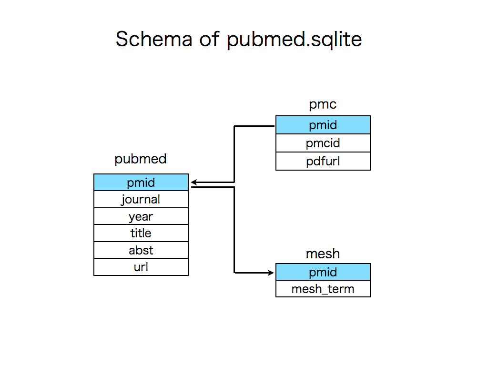

# Pubmed_large
=======

#Pipeline for converting .xml to .sqlite of Pubmed (NLM licensed)

#To convert .xml to .sqlite

At first, you have to get licence of NLM. 

download XML files of Pubmed from http://www.ncbi.nlm.nih.gov/pmc/tools/ftp/ (articles.A-B.tar.gz, articles.C-H.tar.gz, articles.I-N.tar.gz and articles.O-Z.tar.gz)

Second, put these files in Put_Data_Here directory and decompress them.

Finally, run this shell script (it costs several hours). 

    ./pubmed_small.sh

This script parses the xml and you can get pubmed.sqlite.